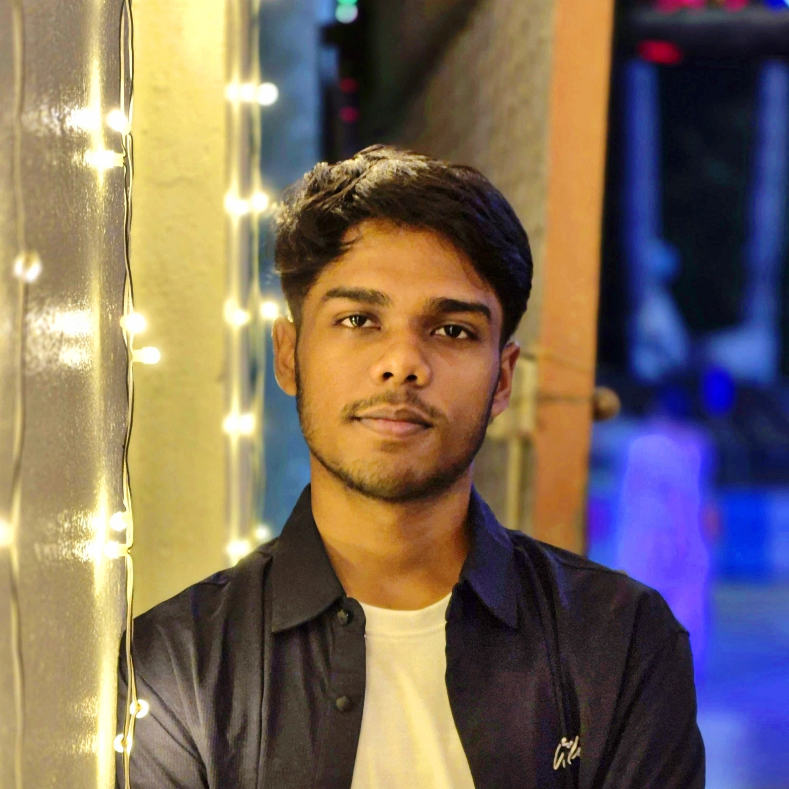

# Portfolio — Soham Singh

> Personal portfolio website built with a neumorphic design system. Pure HTML, CSS (Tailwind), and vanilla JS — no frameworks, no build step.

[](https://your-site.netlify.app)
[](https://github.com/Som007-builds)

---

## Pages

| Page | Route | Description |
|------|-------|-------------|
| The Hub | `/` | Hero, Foretyx flagship, approach cards |
| Systems | `/systems.html` | 3 project case studies with architecture diagrams |
| The Lab | `/lab.html` | Experiments, incubation ideas |
| The Codex | `/codex.html` | Engineering journal entries |
| Contact | `/contact.html` | Contact form (Formspree) |

---

## Stack

- **HTML5** — semantic, no framework
- **Tailwind CSS** — via CDN, no build step
- **Vanilla JS** — dark mode, page transitions, form handling
- **Formspree** — contact form backend
- **Google Fonts** — Space Grotesk + Inter
- **Material Symbols** — icon system

---

## Design System

Neumorphic soft UI with full dark mode support.

```
Light surface:  #f9f9f9
Dark surface:   #1a1d2e

Primary:        #5d3fe0  (light)
Primary dark:   #917eff  (dark)

Light shadows:  -8px -8px 20px #ffffff, 8px 8px 20px #bebebe
Dark shadows:   -8px -8px 20px #12141f, 8px 8px 20px #22263a
```

Theme is persisted via `localStorage` and respects `prefers-color-scheme` on first visit.

---

## Projects Featured

### 1. Foretyx
AI data privacy infrastructure — a middleware security layer between AI models and sensitive enterprise data. Handles PII filtering, anonymization, and access control.

### 2. AI Browser Chatbot
Browser-native AI assistant powered by Ollama (DeepSeek/LLaMA). Fully local, zero API cost, works offline.

### 3. Smart Home Automation System
Cost-effective AI-assisted home automation for Indian households. Central hub controlling appliances via WiFi relays, under ₹10,000.

---

## File Structure

```
Portfolio-Neumorphism/
├── index.html        # The Hub (home)
├── systems.html      # Projects / case studies
├── lab.html          # Experiments
├── codex.html        # Engineering journal
├── contact.html      # Contact form
├── theme.js          # Dark mode logic (shared)
├── profile.webp      # Profile photo
└── README.md
```

---

## Local Development

No build step needed. Just open any HTML file in a browser:

```bash
# Clone the repo
git clone https://github.com/Som007-builds/Portfolio-Neumorphism.git

# Open in browser
open index.html
# or use Live Server in VS Code
```

---

## Deployment

Hosted on **Netlify** with auto-deploy on every push to `main`.

```bash
# Make changes locally, then:
git add .
git commit -m "your change description"
git push
# Netlify redeploys automatically in ~20 seconds
```

---

## Adding Your Photo

Replace the photo placeholder in `index.html`:

```html
<!-- Find this comment block and replace with: -->

```

---

## Contact

- **GitHub** — [Som007-builds](https://github.com/Som007-builds)
- **LinkedIn** — [soham-singh-a21688307](https://www.linkedin.com/in/soham-singh-a21688307/)
- **College** — IT @ Netaji Subhash Engineering College, Garia (NSEC)

---

*Built with Tactical Softness.*
